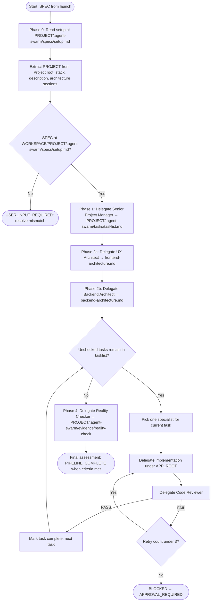

# Agents Orchestrator — workflow

Visual reference for the pipeline in [`.opencode/agents/agents-orchestrator.md`](../../agents/agents-orchestrator.md).

## Flowchart

While the pipeline runs, maintain an append-only log at **`PROJECT/.agent-swarm/docs/pipeline-log.md`** (see agent definition and **`AGENTS.md`**).

## Phase summary

| Phase | Purpose |
|-------|---------|
| 0 | Read spec at **`WORKSPACE/PROJECT/.agent-swarm/specs/setup.md`**; derive **PROJECT**; align with **Project root** |
| 1 | Task list from spec (**Senior Project Manager**) → **`PROJECT/.agent-swarm/tasks/tasklist.md`** |
| 2 | **UX Architect** → **`PROJECT/.agent-swarm/docs/frontend-architecture.md`**; **Backend Architect** → **`backend-architecture.md`** |
| 3 | Implement → Review loop per task; retries; optional **BLOCKED** gate |
| 4 | Integration / reality check (**Reality Checker**); evidence under **`PROJECT/.agent-swarm/evidence/`** |

**Note:** **`PROJECT`** is the slug (directory under **WORKSPACE**). Swarm artifacts live under **`WORKSPACE/PROJECT/.agent-swarm/`** — short filenames (`setup.md`, `tasklist.md`, …), no slug prefix in the file name. Product code stays under **`APP_ROOT`** (`WORKSPACE/PROJECT`).
