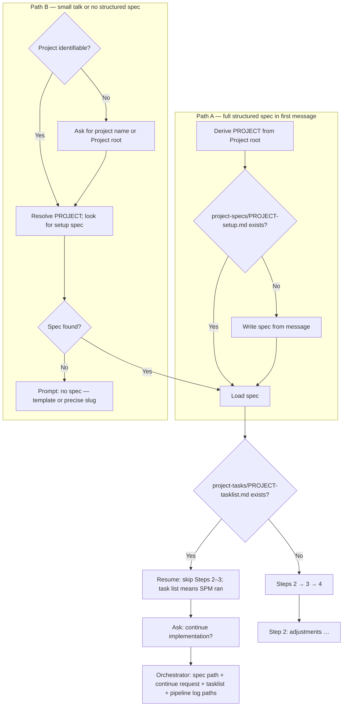
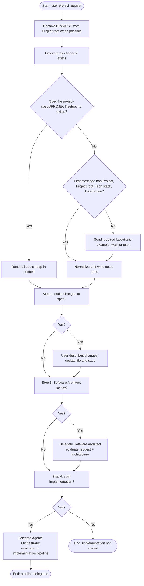

# Project Specification Agent — workflow

Visual reference for the workflow defined in [`.opencode/agents/project-specification.md`](../../agents/project-specification.md).

## Entry routing and resume shortcut

## Main flowchart (Steps 2–4 when no resume)

## Step summary

| Step | Purpose |
|------|---------|
| Entry | Path A (full spec first message) or Path B (small talk → identify project → find or create spec) |
| Resume | If `project-tasks/{{PROJECT}}-tasklist.md` exists → skip Steps 2–3; ask only to **continue implementation** (then Orchestrator) |
| 1 | Mechanics: resolve `{{PROJECT}}`, ensure `project-specs/`, load or create `project-specs/{{PROJECT}}-setup.md` |
| 2 | Optional edits to the setup spec |
| 3 | Optional Software Architect pass |
| 4 | Start or **continue** implementation → Agents Orchestrator |

**Note:** Product code is never implemented by this agent; only the setup spec document and delegations as described.
